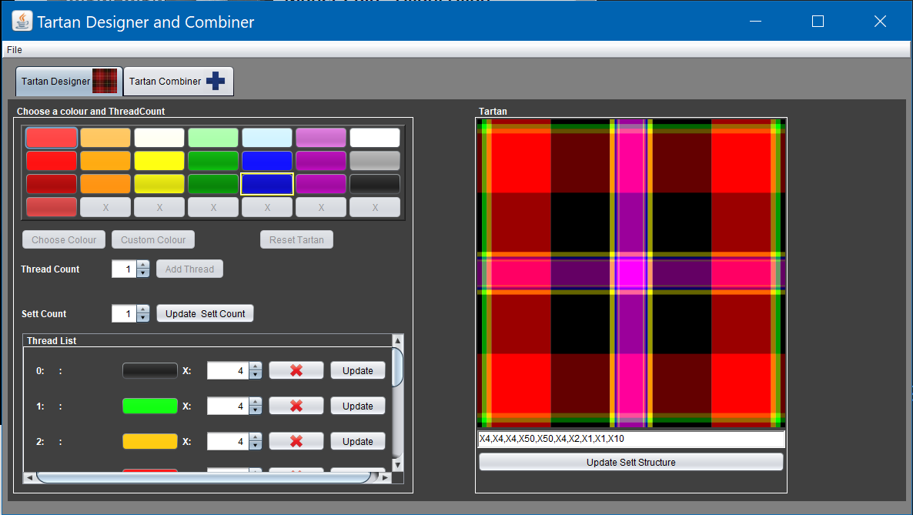
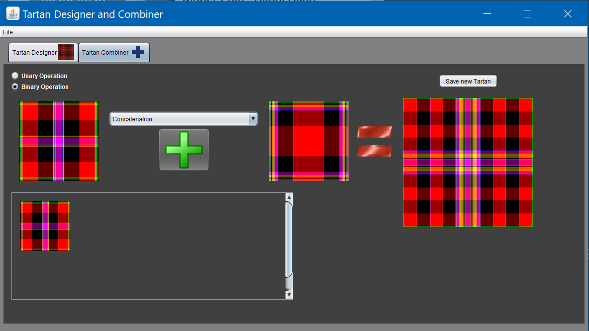

   

* Quick summary   
This is the ultimate tartan generator in the history of tartans. Don't mess with it.

* Requirements
Java 1.8

Run the TartanMVC.java main class

* Create a tartan

* Combine tartans
